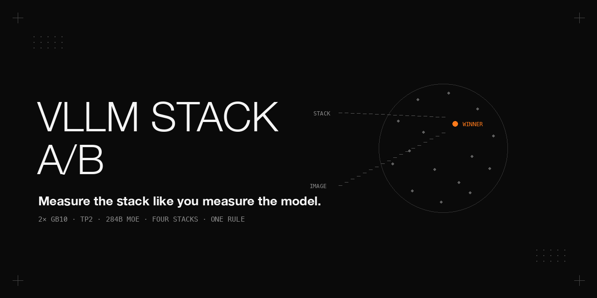

<p align="center"></p>

# vLLM serving-stack A/B on 2× Dell Pro Max with GB10

How we decided, with numbers, which community vLLM stack serves **DeepSeek-V4-Flash-Vision-Exp** (284B MoE, native vision, DSpark speculative decoding) on a two-node GB10 cluster (TP2 over RoCE) — and the thirteen things that went wrong on the way. The original comparison was run on 2026-09-16/17 on the boxes listed below; the dated update records later observations and open questions.

**If you only read one thing:** the same model on the same two machines gave us *engine hangs on the first image* on one stack, *KV pool halved* on another, and *five consecutive failed boots* on a third. The stack is not a detail. Measure it like you would measure the model.

## Update (2026-10)

What happened to the winning stack. Unless stated otherwise, these observations concern two Dell Pro Max with GB10 machines, TP2 over RoCE. Recorded measurements, incident observations, inspection findings and untested plans are distinguished below.

- **Production timeline (observed).** Stack B became production on 2026-09-17. On 2026-09-20 the same stack and recipe family served Qwen3.8-Flash-Next in a 1M mode on the same pair; the DeepSeek-V4-Flash-Vision-Exp mode remained a rollback target. That DeepSeek mode returned as the production fallback tier on 2026-09-25 at about 01:10–01:14 local time. On 2026-09-26 at about 07:30 local time, the production tier moved to a single-node, vision-capable EXL3 build of the same model, freeing the second node for other work; Stack B became a rollback tier. The decision accepted lower scores on a private 11-category evaluation bank, whose questions and scores are not published here. Stack A's image was deleted during disk cleanup on 2026-09-24, ending its one-command rollback.

- **Cold prefill (measured, 2026-09-25).** The 1M-context cold-prefill ladder passed on Stack B, once per size. See the sibling DeepSeek-V4-Flash-Vision-Exp repository update for the ladder, its conditions and gateway caveats; the ladder numbers are not repeated here.

- **Two engine deaths; one complete hang log (observed).** Deaths on 2026-09-19 and 2026-09-25 both followed the 2026-09-18 platform update to kernel `7.0.0-1019-nvidia` and driver `580.178.04`, on one image digest of the 2026-09-13 nightly (`vLLM 0.1.dev20759`), with DSpark speculative decoding enabled at 6 tokens. The 2026-09-19 thinking-mode evaluation allowed 16,384 output tokens and ended with HTTP 500, then connection refused; removal of the container destroyed its logs. Its effort level and hang signature were not recorded, so it is a second death under a similar workload, not a second confirmed identical hang. On 2026-09-25 the workload included maximum-effort thinking, planned concurrency 2 and 32,768 max output tokens, plus other traffic. The log showed 3 or 4 running requests in 674 of 855 samples between 06:14:44 and 08:39:55 UTC, with up to 8 at times; image inputs were present, multimodal cache hit rate was 42.4 % and prefix-cache hit rate 10.6 %. At the hang there was no prefill and KV usage was 0.4 %.

- **The complete log (2026-09-25, UTC).** Throughput fell from 41 tokens/s at 08:39:45 to 0 at 08:39:55, just after running requests fell from 3 to 1. From 08:40:45 through 08:43:45, four once-per-minute lines reported `No available shared memory broadcast block found in 60 seconds`. At 08:44:44, `RPC call to sample_tokens timed out` killed the engine core and the API server then exited, about 4 min 50 s after throughput reached 0. The scheduler dump showed one request with 5,912 computed tokens and 5,595 output tokens; container start was 06:11, about 2.5 hours earlier. The container remained `Up`, a TP worker still held 106,270 MiB of GPU memory and GPU utilization remained 96 % after engine death; neither node's kernel log showed out-of-memory or GPU Xid errors. Incident notes report that `/health` returned 200 during the hang and failed only after engine death; no per-minute health samples were saved.

- **Inspection is not a diagnosis (2026-09-25).** Inspection of the running image and configuration ruled out an older system NCCL library (mapped version: `2.31.2`), missing `sm_121` kernels (`sm_121a` was present), adaptive speculative verification (default off), a missing shared-memory lost-notification fix (already present, with a 5 s recheck), GPU errors during serving, sliding-window-layer YaRN misuse (equivalent fix present), and locked-memory limits (RoCE worked and collectives had run for 9 hours or more). These were inspection findings, not controlled experiments. The kernel update is only a weak association: the known regression produces a memory-registration error at startup, which was not seen. A literature sweep recorded at least four reports of the signature on different builds between 2026-09-07 and 2026-09-22, including one on the same image digest, with no root cause or merged fix in the sources read. This is secondary evidence; those links were not re-fetched or independently verified for this update.

- **Controls and mitigations have limits.** The same thinking-off workload ran about 2.3 hours on Stack B with zero errors (observed). A separate synthetic stress on the single-node EXL3 build ran 102 minutes total: maximum effort with 32,768 max output tokens at concurrency 2, 4 and 6, plus high effort at concurrency 2, with no stalled stream. At concurrency 6, five of six streams reached the 1,700 s client timeout without finishing: slow, not stopped. These observations were recorded by this 2026-10 update; exact control-run dates were not supplied. The different engine, single GPU and synthetic load do not establish that TP2 or this recipe causes the hang. On 2026-09-25 the maximum-effort quality tier was removed from all production fallback chains; a test confirmed 4 of 4 chains reached the thinking-off entry when the primary and first fallback were dead. See the [thinking-tier proxy repository](../thinking-tier-proxy). Whether that tier was later restored to any chain is **unverified**. The monitor gained an engine-health probe, which detects death only after the engine dies; see the [swap repository update](https://github.com/ryangu00/dell-pro-max-gb10-zero-downtime-model-swap#update-2026-10-what-happened-after-the-cutover). Recovery on 2026-09-25 required stopping everything, confirming GPU memory release on both nodes and starting again, with about 10 minutes of lost fallback capacity.

- **Hang A/B: designed, never run.** A replay harness with death-signature detection and evidence collection and a candidate plan were built. Candidates included speculative decoding off, lower speculative width, another MoE kernel, eager mode and a longer execute-model timeout. Three independent reviewers found 39 issues; three blockers were fixed in the plan. The work was parked on 2026-09-25 as the move to a single-node engine began. Neither baseline reproduction nor any candidate arm ran; the harness had only short smoke runs of a few minutes with zero errors. No candidate is a demonstrated fix. The first synthetic load—concurrency 2, text only, prefix caching defeated—did not match the incident's 3–8 running requests, images and bursts of 57–60 requests per minute. A clean 6-hour run of that load would have been misleading. **Open:** root cause and mechanism remain unknown, based on only two deaths on one image digest and one driver/kernel combination. Lower effort with long generations and other concurrency remain unverified.

- **Public switch-script hardening (2026-10).** The abstraction now starts the tier proxy before the engine, verifies the launched PID owns every configured proxy port within a 15 s polling window, and requires HTTP 200 from each proxy port after engine startup. Failed stops or residue checks exit non-zero, and failed boots clean up the launched proxy PID. The real-generation liveness check remains. This hardened public script was **tested with stubs only, not on hardware**; it is not production-proven. Run `bash tests/test_stack_mode.sh` for the offline checks.

## What is in this repo

| Path | What it is |
|---|---|
| `bench/k1_speed.py` | single-stream decode, **cold** prefill (unique salt per run so prefix caching cannot warm-hit), 6-stream aggregate |
| `bench/k3_vision_multistream.py` | synthetic OCR (10 images × 5 positions — catches the "half-causal image attention" bug) + 6 concurrent animated-SVG generations parsed as XML (catches multi-stream MoE corruption) |
| `bench/accept.sh` | structural acceptance: thinking off/on, tool call, default behaviour, engine facts from the container log |
| `bench/gateway_probe.sh` | proves the gateway in front of the cluster kept answering during the switch window |
| `switch/stack-mode.sh` + `stack-modes.example.yaml` | switches stacks with a PID-verified tier proxy started before the engine, real-generation liveness, an 8-min/15-min dead-boot rule, rollback and non-zero exits on failures |
| `docs/decision-rule.md` | the rule we froze **before** running anything, and what an independent review made us change |
| `docs/pitfalls.md` | thirteen firsthand incidents, each with the symptom, the cause and the fix |
| `docs/results.md` | the four-column before/after table |

Tool-calling quality is measured with [`tool-eval-bench`](https://github.com/SeraphimSerapis/tool-eval-bench) (hardmode, 88 scenarios) — not ours. We ran `2.6.1.dev72+gd84fce442`; install that exact commit (see Quick start) if you want comparable scores.

## Prerequisites

- Two nodes with passwordless SSH from the machine running these scripts; Docker on both; `sudo -n` allowed for `drop_caches` (or delete those two lines in `switch/stack-mode.sh`).
- Python 3.10+ with `Pillow` for `bench/k3_vision_multistream.py` (`pip install pillow`); `bench/k1_speed.py` is stdlib-only.
- `bash`, `awk`, `sed`, `curl`, `python3` on the machine running the scripts.
- [`uv`](https://docs.astral.sh/uv/) for `tool-eval-bench`.
- `bench/accept.sh` reads engine facts with `docker logs`/`docker inspect` on the machine it runs on: run it **on the head node** (or omit the container argument and take the engine facts from the node by hand).
- A thinking-tier proxy is optional; leave `proxy_start`, `proxy_kill` and `proxy_ports` empty to omit it. Otherwise set space-separated `proxy_ports` and a non-daemonizing `proxy_start` command that retains its launched PID. The proxy starts before the engine; PID or HTTP checks and stop failures cause a non-zero exit. Stop commands must tolerate already-absent resources.
- With a proxy configured, `ss` (iproute2) must exist on both nodes for residue checks, and `setsid`/`nohup` on the head node for startup. The head-node user must see its own process PIDs in `ss -ltnp`; this visibility was checked once as an ordinary user on a GB10 node. Root-owned container PIDs are not visible to that user, so PID ownership verification applies only to the proxy.

The benchmark scripts take the engine base URL as an optional argument (default `http://127.0.0.1:8000/v1`). Environment knobs: `BENCH_MODEL` (served name, default `deepseek-v4-flash-vision-exp`), `BENCH_OUT` (results dir, default `./results`), `K3_SKIP_VISION=1` (text-only endpoint: record vision as N/A), `K3_PART2_ONLY=1` (re-run only the 6-stream part, reuse the saved vision result), `ACCEPT_EVIDENCE` (path for `accept.sh` output), `STACK_MODES` (yaml path for `stack-mode.sh`), `STACK_LOG_DIR` (failed-boot logs, default `results/` in this repository) — all optional. For `gateway_probe.sh`: `GATEWAY_KEY` is **required**; `GATEWAY` defaults to `http://127.0.0.1:4000`; `ROUTES` and `PROBE_LOG` are optional. Remote launcher logs use paths relative to the SSH working directory.

## Hardware and what we compared

| | |
|---|---|
| Nodes | 2× Dell Pro Max with GB10 (128 GB unified memory each), direct RoCE link, TP2 |
| Model | `deepseek-ai/DeepSeek-V4-Flash-Vision-Exp`, snapshot `6821d6ad`, 48 shards, 156 GB |
| Baseline "before" | the first two-node layout we ran: Qwen3.8-27B NVFP4 (single node, thinking-tier proxy) + DeepSeek-V4-Flash-0731 EXL3 single-seat on the other node — two independent models, no TP |
| Stack A | Anemll `dspark-vllm-gx10:0.1.1` (vLLM 0.25 fork, B12X MoE, DSpark k=6) — our production from 2026-09-01 until 2026-09-17; the image was deleted from the nodes on 2026-09-24, so the one-command rollback to Stack A no longer exists |
| Stack B | eugr `spark-vllm-docker` recipe `deepseek-v4-flash-vision-exp.yaml` (vLLM ~0.29 build, B12X MoE with MXFP8 activations, InstantTensor loader + hybrid draft mod) |
| Stack C | the `ollie-gb10-serving-stacks` repo's `vision-exp-stack` (a community vLLM 0.28.1 image, marlin MoE, DSpark k=5, vision + prefix-cache fixes) — first as shipped, then with eugr's hybrid draft loader mod added |

## Results

See [`docs/results.md`](docs/results.md) for the full four-column table and the per-round narrative. Headline numbers are reproduced there, not here, so that this README never disagrees with the table.

## Quick start (reproduce the harness on your own cluster)

```bash
git clone <repository-url>
cd dell-pro-max-gb10-vllm-stack-ab
cp switch/stack-modes.example.yaml switch/stack-modes.yaml   # edit nodes, port, served name, one block per stack
switch/stack-mode.sh status

# Baseline on the incumbent, in the order the decision rule prescribes: accept → K3 → K1 ×2 → K2 ×2
uv tool install "git+https://github.com/SeraphimSerapis/tool-eval-bench.git@d84fce442aee49ffe433108901fd4216a784eefb"
bench/accept.sh http://<api>:<port>/v1 <served> <container>   # run on the head node; exits non-zero if any check fails
python3 bench/k3_vision_multistream.py A http://<api>:<port>/v1
python3 bench/k1_speed.py A http://<api>:<port>/v1 && python3 bench/k1_speed.py A http://<api>:<port>/v1
for t in 1 2; do tool-eval-bench --backend vllm --base-url http://<api>:<port> --model <served> --hardmode --seed 42 --parallel 4 \
  --backend-kwargs '{"chat_template_kwargs":{"thinking":true,"reasoning_effort":"high"},"temperature":0.5,"top_p":0.95}' \
  --json-file results/A-K2-trial$t.json; done

# Challenger: keep the gateway probe running through the window, switch, then repeat the exact same sequence with label B
GATEWAY=http://127.0.0.1:4000 GATEWAY_KEY=... ROUTES="main" bench/gateway_probe.sh &
switch/stack-mode.sh <mode>                                  # a mode name from your stack-modes.yaml, e.g. eugr
bench/accept.sh http://<api>:<port>/v1 <served> <container>
```

Then apply `docs/decision-rule.md`. Write the rule down before the challenger boots.

## What we would tell someone starting this on a GB10 pair

1. **`/health` lies.** Liveness is a real generation. We saw it a second time, on the winning stack, during a tensor-parallel hang with no error in the log at the onset (see the [Update (2026-10) section](#update-2026-10)): the engine had stopped producing tokens and the health endpoint still said 200.
2. **Do not mmap the checkpoint** on GB10. Use InstantTensor *with* the hybrid draft mod for models that embed their draft layers.
3. **Pin the image digest** you benchmarked; `latest` moved under us within a week.
4. **Freeze baseline scalars and the rule first.** A single `tool-eval-bench` trial at temperature 0.5 moves ±2 points; run two, add a third only when the mean lands on the line.
5. **Declare a boot dead on a timer.** Eight minutes without a new log line, or fifteen minutes total, then capture logs and roll back. Our first failed boot cost 28 minutes of staring.
6. **Host `earlyoom` at 6 % free will kill you** during weight load; the community runs ~512 MB.

## License

Apache-2.0 — see [LICENSE](LICENSE).
